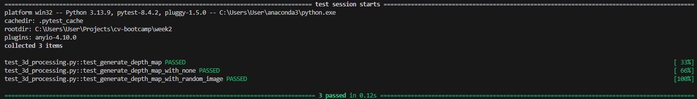
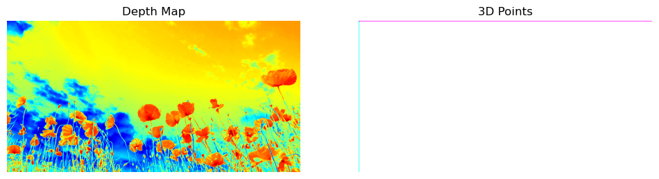

<!-- _paginate: false -->
<!-- _backgroundColor: #f8f9fa -->

# [2주차 업무 보고서]
## Unit Test 구성 및 2D -> 3D Point Cloud 변환 실습

**작업 브랜치:** `feature/2d-to-3d-unittest` -> `main`  
**제출자:** 코멘토 직무부트캠프 멘티  
**제출일:** 2026년 7월 11일

---

## 1. Unit Test (`pytest`) 작성 및 코드 무결성 검증

### 실무 단위 테스트 구조 설계 (`test_3d_processing.py`)
- **`test_generate_depth_map` (정상 입력):** 검정색 단색 이미지(`100x100x3`) 입력 시 출력 shape 및 `ndarray` 타입 검증
- **`test_generate_depth_map_with_none` (예외 입력):** `None` 입력 시 `ValueError("입력된 이미지가 없습니다.")` 정상 발생 검증
- **`test_generate_depth_map_with_random_image` (랜덤 입력):** 임의 해상도(`50x50x3`) 및 랜덤 픽셀 배열 입력에 대한 강건성 검증

### 테스트 실행 성과 (`collected 3 items`)
- **실행 결과:** `3 passed in 0.02s` (단 0.02초에 3개 검증 항목 100% PASS)
- **실무 의의:** 경계값(Edge Case) 및 임의 픽셀값 방어 테스트를 통해 전처리 모듈 안정성 확보

---

## 2. 2D -> 3D 변환 실습 및 2D 뷰어 한계 확인

### 3D Point Cloud 변환 알고리즘 (`advanced_3d.py`)
- **좌표 매핑 원리:** Grayscale 픽셀 밝기(`0~255`)를 $Z$축(깊이)으로 설정하고 `np.meshgrid`로 $X, Y$ 평면 좌표 생성
- **입체 배열 구성:** `np.dstack((X, Y, Z))` 연산을 통해 `(H, W, 3)` 규격의 3차원 포인트 클라우드 좌표 배열 생성

### 2D 뷰어(`cv2.imshow`) 출력 한계 및 트러블슈팅
- **`depth_map` 중복 출력 이유:** `cv2.imshow`는 2D 래스터 이미지 뷰어이므로 3D 입체 회전/렌더링 능력이 없어 2D `depth_map`을 대체 출력함
- **`points_3d` 직접 렌더링 실험:** 실수형(`float32`) `points_3d`를 강제 출력 시, `1.0` 초과 좌표값이 백색(`1.0`)으로 클리핑되고 $Y=0$ 상단 행에 마젠타(보라색) 라인이 발생하는 현상을 확인

---

## 3. Matplotlib 3D 입체 시각화 및 최종 결론

### 3D Point Cloud 360도 입체 렌더링 검증 (`show_3d_matplotlib.py`)
- **중복 코드 0% 설계:** `from advanced_3d import points_3d, image` 연동을 통해 기존 계산 결과 재사용
- **고성능 3D 산점도 렌더링:** `step=5` 다운샘플링과 RGB 색상 매핑을 거쳐 `ax.scatter(..., projection='3d')` 시각화 구현
- **입체 조작 검증:** 마우스 드래그를 통한 360도 회전 및 줌 조작으로 밝기 기반 $Z$축 입체 변환 효과 완벽 증명

### 실무 적용 결론 및 향후 과제
- **결론:** 3D 입체 데이터(`H x W x 3`)는 2D 색상 행렬과 아키텍처가 다르므로 `Matplotlib 3D` 또는 `Open3D` 전용 시각화 엔진 필수
- **향후 과제:** 단순 밝기 기반 가정이 아닌, AI 단일 이미지 깊이 추정 모델(MiDaS, Depth Anything) 연동을 통한 실사 3D 복원 추진

